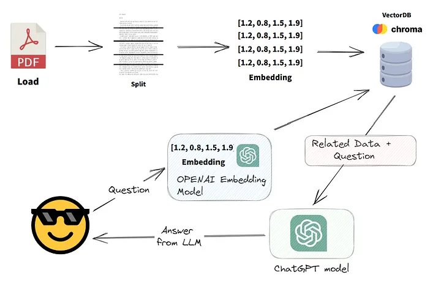

This project aims to use the Mistral AI API to make a RAG application based on PDF files from ... 
This project is based on medium : [article 1](https://medium.com/@jh.baek.sd/creating-an-ai-web-service-using-langchain-with-streamlit-using-llama-2-or-chatgpt4-83a824e19435), [article 2](https://saiharishcherukuri.medium.com/pdf-summarizer-and-question-answering-unlocking-insights-from-pdf-documents-f8933620b1c4), [article 3](https://medium.com/@karanshingde/power-your-rag-application-using-qdrantdb-mistral-8x7b-moe-langchain-and-streamlit-15cd90ad4d49).

What is RAG Application ? To enable the local model to also have knowledge of data outside of its training data, e.g. company or research data, you can embed this data into a vector database and let an LLM retrieve the relevant documents and data. The LLM will then construct a coherent answer with the retrieved data. It enables you to connect pre-trained models to external, up-to-date information sources that can generate more accurate and more useful outputs.

We need:
- PDF files or others types of input data to retrieve
- Model embedding
- vector database to stock the data embedded
- LLM model via API or installed on local machine
- (Web) User interface with a prompt to easily ask questions

To do so we will use:
- LangChain to make the connection 

- ChromaDB as a vector database

- Mistral API for the LLM model and Embedding model

- Stremalit for the web interface

Maybe later we will use a local Model rather than API.